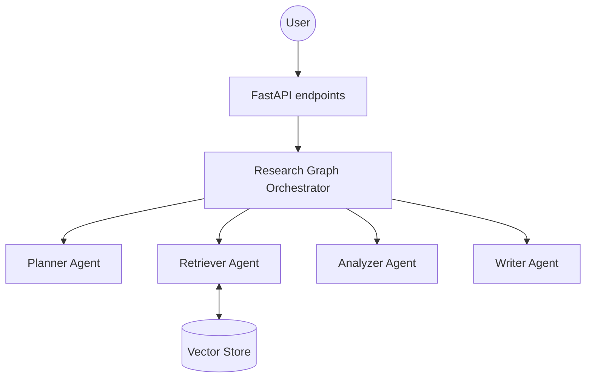

# Multi-Agent AI Research Assistant


## Overview
The Multi-Agent AI Research Assistant is a comprehensive system for performing deep research, analyzing documents, and drafting cohesive reports autonomously. Utilizing an ensemble of specialized AI agents, it can crawl, retrieve, analyze, and synthesize large amounts of context to answer complex queries.

## Architecture



### The 4 Agents
- **Planner Agent**: Analyzes the initial query and breaks it down into actionable sub-tasks.
- **Retriever Agent**: Responsible for interacting with vector stores and retrieving contextually relevant documents.
- **Analyzer Agent**: Extracts key insights and relationships from the retrieved documents.
- **Writer Agent**: Synthesizes the analyzed information into a coherent, comprehensive research report.

## Tech Stack
- **Backend Framework**: FastAPI
- **AI/LLM orchestration**: LangChain, LangGraph
- **Vector Database**: FAISS (local via VectorStoreManager)
- **Containerization**: Docker, Docker Compose
- **CI/CD**: GitHub Actions
- **Testing**: Pytest

## Quick Start
1. Clone repo:
   ```bash
   git clone https://github.com/example/multi-agent-research-assistant.git
   cd multi-agent-research-assistant
   ```
2. Copy `.env.example` to `.env` and add your API key:
   ```bash
   cp .env.example .env
   ```
3. Install dependencies:
   ```bash
   pip install -r requirements.txt
   ```
4. Run the development server:
   ```bash
   uvicorn app.main:app --reload
   ```

## Docker Setup
Run the complete stack using Docker Compose:
```bash
docker-compose up --build
```

## API Documentation
Key endpoints:
- `GET /health` - Health check.
- `GET /health/ready` - Readiness check.
- `POST /api/v1/research` - Submit a new research query.
- `POST /api/v1/documents/upload` - Upload documents to the knowledge base.
- `GET /api/v1/documents` - List uploaded documents.

## Running Tests
Run the test suite with pytest:
```bash
pytest tests/ -v
```

## Project Structure
```
.
├── .github/
│   └── workflows/
├── app/
│   ├── agents/
│   ├── api/
│   ├── rag/
│   ├── config.py
│   └── main.py
├── tests/
│   ├── test_agents/
│   ├── test_api/
│   └── test_rag/
├── Dockerfile
├── docker-compose.yml
└── README.md
```

## Deployment
The project uses GitHub Actions for continuous integration and continuous deployment (CI/CD).
Upon pushing to the `main` branch, the pipeline will test the code, build the Docker image, push it to AWS ECR, and deploy it to an AWS ECS cluster.

## License
MIT
