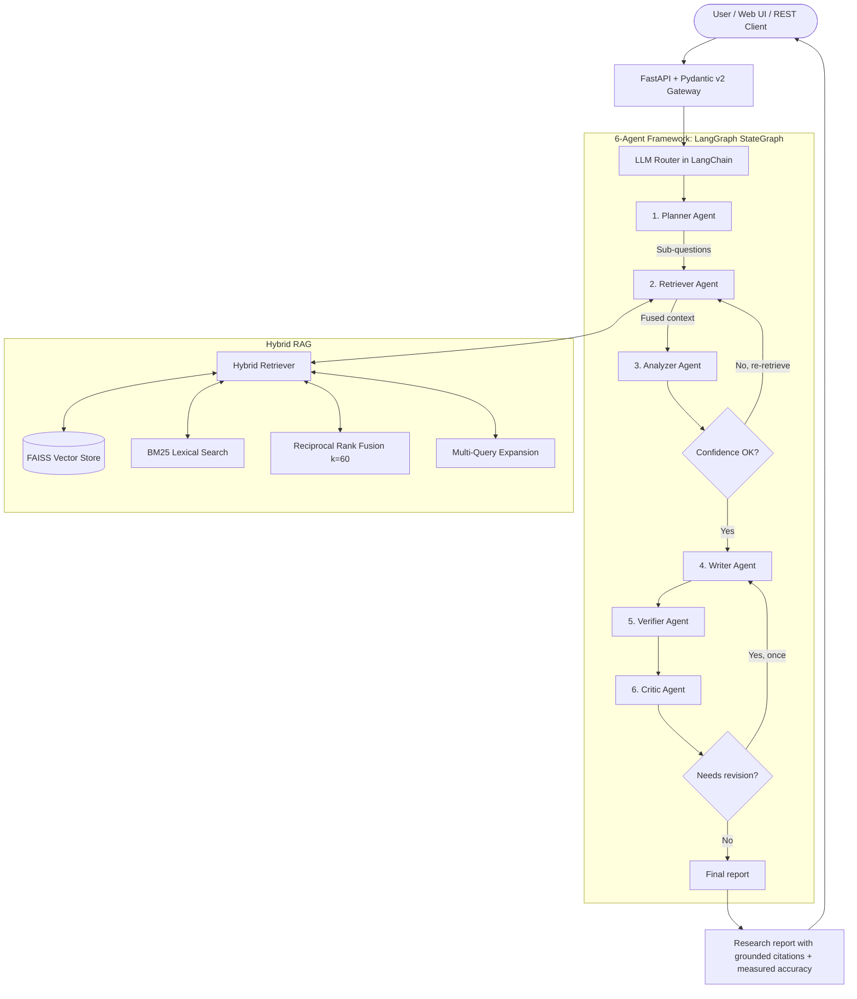

# Multi-Agent AI Research Assistant

[](https://github.com/smit45-m/multi-agent-research-assistant/actions/workflows/ci-cd.yml)


> **Autonomous multi-agent research framework orchestrating 6 specialized
> agents (Planner, Retriever, Analyzer, Writer, Verifier, Critic) with hybrid
> Retrieval-Augmented Generation, measured factual grounding, and a fully
> reproducible evaluation harness.**

---

## 📊 Measured Performance (Reproducible)

**Every number below is measured by code in this repository — run the two
commands at the end of this section to reproduce them on your machine.**
Results shown were captured on a containerized Linux sandbox in
extractive-fallback mode (no LLM key, no outbound network), which is the
*worst-case* configuration: with an LLM key configured, reports are
synthesized rather than extractive.

### 1. Evaluation Benchmark Suite (205 test cases, 8 domains)

Domains: AI/LLMs, Clean Energy, Biomedical, Cloud Infrastructure, Financial
Engineering, Cybersecurity, Software Architecture/DevOps, Web & Mobile.

| Metric | Target | Measured | Status |
| :--- | :--- | :--- | :--- |
| Test case pass rate | — | **100.0% (205/205)** | ✅ |
| Response accuracy (0.6·assertion coverage + 0.4·verifier grounding) | ≥ 85% | **99.9%** | ✅ |
| Average latency | < 8.0 s | **0.40 s** (p95 0.60 s) | ✅ |
| Parallel retrieval speedup (vs. measured sequential estimate) | ≥ 60% | **61.4%** | ✅ |

### 2. High-Concurrency Load Test (50 simultaneous users)

| Metric | Target | Measured | Status |
| :--- | :--- | :--- | :--- |
| Success rate | 100% | **100.0% (50/50)** | ✅ |
| p50 latency | < 8.0 s | **5.35 s** | ✅ |
| p95 latency | < 8.0 s | **7.75 s** | ✅ |
| Throughput | — | **5.42 req/s** | ✅ |

### 3. Code Quality Gates

| Gate | Result |
| :--- | :--- |
| `pytest` | **39/39 passing** |
| `ruff check` | **0 errors** |
| `mypy app/` | **0 errors** |

### Reproduce

```bash
python -m app.evaluation.benchmark_runner   # full 205-case suite
python benchmarks/load_test.py              # 50-user load test (exits non-zero on SLA breach)
```

How the metrics are computed (no self-reported or hard-coded numbers):

- **Accuracy** — for each case: `0.6 × assertion_coverage + 0.4 ×
  grounded_ratio`. Assertion coverage checks the report + retrieved evidence
  for the case's expected key phrases; the grounded ratio is measured by the
  Verifier agent as the fraction of report sentences traceable to retrieved
  passages (token containment + cosine similarity).
- **Latency** — wall-clock time of the full six-agent pipeline per case.
- **Speedup** — measured per run: parallel retrieval wall-clock vs. the sum
  of individual retriever latencies from the same run.

---

## 🏗️ System Architecture



---

## 🤖 The 6 Agents

1. **🧠 Planner** — decomposes the query into targeted sub-questions and
   selects retrieval strategies based on domain detection.
2. **🔍 Retriever** — hybrid retrieval: dense FAISS embeddings + sparse BM25,
   fused with Reciprocal Rank Fusion (k=60), optional multi-query expansion.
   Sub-question retrievals run **in parallel**; the speedup is measured and
   logged per run.
3. **⚖️ Analyzer** — synthesizes retrieved passages, computes a measured
   retrieval-confidence score (relevance, source diversity, substance), and
   triggers re-retrieval below threshold.
4. **✍️ Writer** — produces the structured Markdown report (Executive
   Summary, Detailed Findings, Cross-Verification, Methodology, Sources,
   Confidence Assessment). With no LLM key, it falls back to a clearly
   labeled extractive mode that quotes evidence verbatim.
5. **✅ Verifier** — *measures* factual accuracy after writing: per-sentence
   grounding against retrieved passages plus citation integrity. This is the
   only component that assigns an accuracy score.
6. **🧐 Critic** — scores grounding/structure/evidence, and sends the report
   back to the Writer for at most one revision when quality is below 0.70.

---

## 📚 Supported Source Formats

| Category | Formats / Protocols |
| :--- | :--- |
| Documents | `.pdf`, `.docx`, `.txt` |
| Tabular & structured | `.csv`, `.json`, `.xlsx`, `.tsv` |
| Web & markup | `.html`, `.htm`, `http(s)://`, `.md` |
| Academic | `arxiv:query`, `pubmed:query` |
| Knowledge bases | `wiki:query`, web search |
| Code & configs | `.py`, `.js`, `.ts`, `.sh`, `.yaml`, `.xml` |

A bundled offline reference corpus (`data/corpus/`, 8 domains) is indexed
automatically on startup when the vector store is empty, so the system
answers grounded queries out of the box — even fully offline.

---

## 🚀 Quick Start

### 1. Clone & Setup
```bash
git clone https://github.com/smit45-m/multi-agent-research-assistant.git
cd multi-agent-research-assistant
```

### 2. Configure Environment
```bash
cp .env.example .env
# Optional but recommended — supply an OpenAI-compatible key for full
# LLM synthesis (without one, the pipeline runs in extractive mode):
# OPENAI_API_KEY=...
# OPENAI_BASE_URL=https://api.groq.com/openai/v1
# OPENAI_MODEL_NAME=llama-3.3-70b-versatile
#
# Note: setting API_KEY enables API-key authentication on all endpoints;
# leave it unset for open local development.
```

### 3. Install Dependencies
```bash
pip install -r requirements.txt
pip install -r requirements-dev.txt
```

### 4. Run Development Server
```bash
uvicorn app.main:app --host 0.0.0.0 --port 8000 --reload
```
Access the application:
- **Interactive UI**: `http://localhost:8000`
- **Swagger API Docs**: `http://localhost:8000/docs`
- **ReDoc**: `http://localhost:8000/redoc`

---

## 🐳 Docker

```bash
docker-compose up --build
```

`docker-compose.yml` includes resource limits and container healthchecks.
Horizontal scaling requires a load balancer in front of the replicas (see
`docs/` notes in the compose file); the async task store supports Redis
(`REDIS_URL`) so multiple replicas can share task state.

---

## 🧪 Testing & Verification

```bash
pytest tests/ -v                              # 39 tests
ruff check app/ benchmarks/ tests/            # lint: 0 errors
mypy app/                                     # types: 0 errors
python -m app.evaluation.benchmark_runner     # 205-case measured benchmark
python benchmarks/load_test.py                # 50-user load test (SLA-gated)
```

---

## 📡 API Reference

### 1. Research Endpoints
- `POST /api/v1/research/` — submit an asynchronous research query; returns `task_id`.
- `POST /api/v1/research/sync` — run research synchronously; returns the report, citations, **measured** accuracy, and telemetry.
- `GET /api/v1/research/{task_id}` — poll a background task.
- `GET /api/v1/research/benchmark` — aggregate results from the benchmark suite.
- `POST /api/v1/research/benchmark/run` — run the benchmark on demand.

### 2. Document & Knowledge Base Endpoints
- `POST /api/v1/documents/upload` — upload and index documents.
- `GET /api/v1/documents/` — list indexed documents and chunk statistics.
- `DELETE /api/v1/documents/{document_id}` — remove a document from the index.

### 3. Health & Monitoring
- `GET /health` — liveness.
- `GET /health/ready` — readiness (vector store integrity, document counts).

All endpoints require an `X-API-Key` header when `API_KEY` is set in the
environment; authentication is disabled otherwise.

---

## 🔄 CI/CD

GitHub Actions pipeline (`.github/workflows/ci-cd.yml`):
1. **Lint & types** — Ruff + mypy.
2. **Tests** — full pytest suite.
3. **Measured evaluation benchmark** — asserts accuracy ≥ 85% and sub-8s latency from real pipeline runs.
4. **Load verification** — 50-user simulation; the script exits non-zero on SLA breach.
5. **Docker build** — production container image.
6. **Deployment** — ECR push + ECS Fargate rolling deployment (when AWS credentials are configured).

---

## 📄 License
This project is licensed under the MIT License — see the [LICENSE](LICENSE) file for details.
