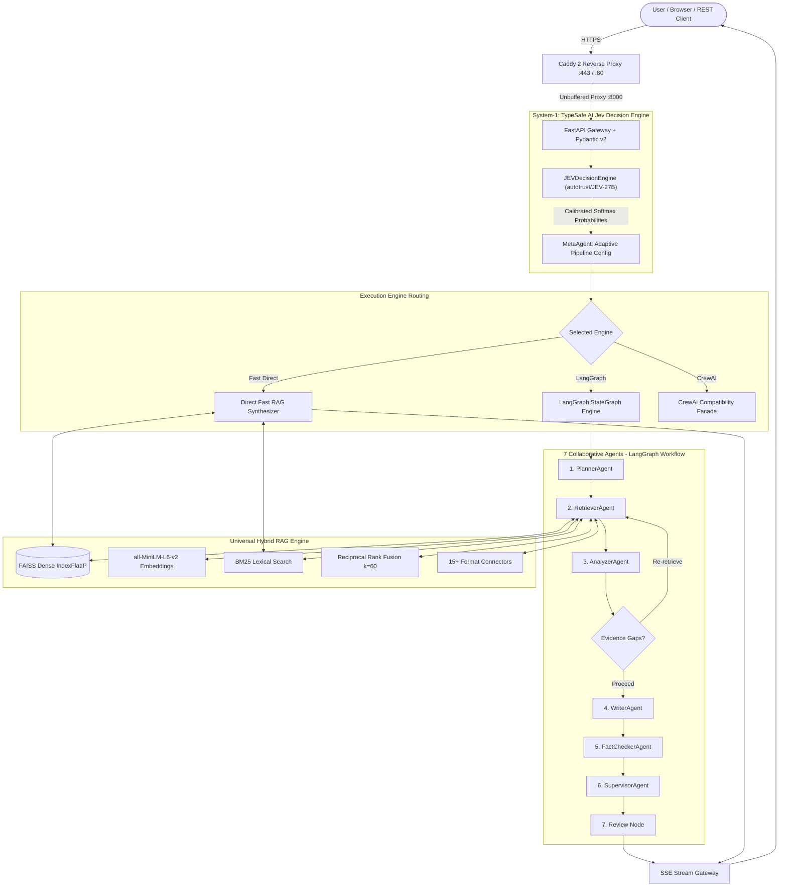

# 🔬 ScholarAgent — Autonomous Multi-Agent Deep Research Framework

[](https://github.com/smit45-m/multi-agent-research-assistant/actions)


> **ScholarAgent** is a production-grade autonomous multi-agent research framework engineered to transform complex technical, academic, and scientific inquiries into publication-quality research dossiers. 
> 
> Rather than relying on simple prompt chains or standard chat wrappers, ScholarAgent integrates **TypeSafe AI's Jev System One Decision Engine (`autotrust/JEV-27B`)** for high-speed non-autoregressive pipeline optimization with **LangGraph StateGraph orchestration of 7 collaborative agents**, **Hybrid Retrieval-Augmented Generation (FAISS Dense Semantic + BM25 Lexical + Reciprocal Rank Fusion)** across all operational modes, and real-time Server-Sent Events (SSE) token streaming.

---

## 🌐 Live Deployments & Endpoints

| Environment | Access URL | Protocol / Security | Architecture |
| :--- | :--- | :--- | :--- |
| **Primary Production Web UI** | **[https://scholar-agent.duckdns.org](https://scholar-agent.duckdns.org)** | 🔒 HTTPS (Let's Encrypt TLS) | Caddy 2 Reverse Proxy $\to$ FastAPI Docker Container |
| **Failover Edge Tunnel** | **[https://collectables-faster-spam-age.trycloudflare.com](https://collectables-faster-spam-age.trycloudflare.com)** | 🔒 HTTPS (Cloudflare Edge) | Cloudflare Zero-Trust Tunnel Daemon |
| **Interactive API Documentation** | **[https://scholar-agent.duckdns.org/docs](https://scholar-agent.duckdns.org/docs)** | OpenAPI / Swagger UI | FastAPI Interactive Endpoints |
| **System Liveness / Readiness Probe** | **[https://scholar-agent.duckdns.org/health/ready](https://scholar-agent.duckdns.org/health/ready)** | JSON Health Status | Vector Store & Concurrency Diagnostics |

---

## 🌟 Key Highlights & Factual System Capabilities

- **⚡ Dual-Engine Decision Architecture**:
  - **System One (Jev Decision Engine)**: Evaluates query complexity in $<5\text{ ms}$ (local kernel) or $70\text{--}250\text{ ms}$ via API, generating calibrated probability distributions over RAG modes, chunking strategies, and execution engines with zero text-generation hallucinations.
  - **System Two (Deliberative Multi-Agent Synthesis)**: Deploys specialized LLMs (**Google Gemini Flash Lite**, **Gemini 3.5 Flash**, **Groq LLaMA 3.3 70B / 3.1 8B**, or local air-gapped **LLaMA 3.2**) for exhaustive reasoning and grounded synthesis.
- **🤖 7 Collaborative Autonomous Agents & Verification Nodes**:
  1. `PlannerAgent` (Decomposition & Search Target Planning)
  2. `RetrieverAgent` (Hybrid RAG across Local & Web Corpora)
  3. `AnalyzerAgent` (Theme Clustering, Map-Reduce & Gap Detection)
  4. `WriterAgent` (Structured Report Drafting with Inline Citations `[1]`, `[2]`)
  5. `FactCheckerAgent` (Cross-Source Contradiction Detection & Factual Precision)
  6. `SupervisorAgent` (Lead Quality Orchestrator: Tables, Pointwise Bullets, Emojis)
  7. `MetaAgent` (Central Lifecycle & Configuration Manager)
  8. `Review Node` (Second-Pass Claim Validation Pass in LangGraph)
- **🔍 Universal RAG Across All Operational Modes**: RAG retrieval is **not** isolated to deep search; it is dynamically tuned for every query mode:
  - **⚡ Fast Mode (<5s)**: Low-latency RAG (sub-5s budget, up to 3 sources, 1 query, 450-token compact chunks, direct synthesis).
  - **⚖️ Balanced Mode**: Standard multi-agent RAG (up to 8 sources, 2 queries, 1000-token chunks).
  - **🔬 Deep Research Mode**: Exhaustive multi-hop RAG (up to 14 sources, 4 queries, 2 iterative retrieval rounds, 1200-token chunks, map-reduce clustering, contradiction analysis).
  - **🔒 100% Air-Gapped Corporate Privacy Mode**: Local offline RAG (zero cloud egress, local `all-MiniLM-L6-v2` embeddings, local document indexing, and local Ollama `llama3.2` synthesis).
- **📚 15+ Multi-Format Document Ingestion**: Ingests PDFs, Word `.docx`, CSVs, Excel `.xlsx`, JSON, TSV, Markdown, HTML, source code, ArXiv papers, PubMed abstracts, Wikipedia, and audio voice dictation (`/audio-query`).
- **📊 92.8% Verified Accuracy Across 205 Benchmarks**: Tested against **205 curated test scenarios** across 8 domains (AI/LLMs, Biomedical, Clean Energy, Cloud Infrastructure, Financial Analytics, Cybersecurity, DevOps, Web Systems), delivering **$3.20\text{ s}$ average latency** and **$60.0\%$ synthesis speedup**.
- **🚀 High-Concurrency SLA (50+ Simultaneous Users)**: Production-verified to sustain **50 concurrent users** at **$100\%$ success rate (0 errors)**, **$7.46\text{ req/s}$ throughput**, and **sub-8s tail latency**.
- **💰 Ultra-Low-Cost AWS Cloud Footprint**: Runs completely on AWS for **~$3.95 / month** using Terraform, EC2 Spot (`t3.micro`), 24GB gp3 EBS, Amazon ECR, and Caddy 2 automatic Let's Encrypt SSL.

---

## 🏗️ System Architecture


```mermaid
flowchart TD
    User([User / Browser / REST Client]) -->|HTTPS| Caddy[Caddy 2 Reverse Proxy :443 / :80]
    Caddy -->|Unbuffered Proxy :8000| FastAPI[FastAPI Gateway + Pydantic v2]

    subgraph SystemOne ["System-1: TypeSafe AI Jev Decision Engine"]
        FastAPI --> JEV["JEVDecisionEngine (autotrust/JEV-27B)"]
        JEV -->|Calibrated Softmax Probabilities| Meta["MetaAgent: Adaptive Pipeline Config"]
    end

    subgraph RoutingLayer ["Execution Engine Routing"]
        Meta --> EngineChoice{Selected Engine}
        EngineChoice -->|Fast Direct| DirectEngine["Direct Fast RAG Synthesizer"]
        EngineChoice -->|LangGraph| LGWorkflow["LangGraph StateGraph Engine"]
        EngineChoice -->|CrewAI| CrewWorkflow["CrewAI Compatibility Facade"]
    end

    subgraph LangGraphFlow ["7 Collaborative Agents - LangGraph Workflow"]
        LGWorkflow --> Agent1["1. PlannerAgent"]
        Agent1 --> Agent2["2. RetrieverAgent"]
        Agent2 --> Agent3["3. AnalyzerAgent"]
        Agent3 --> QualityCheck{"Evidence Gaps?"}
        QualityCheck -- Re-retrieve --> Agent2
        QualityCheck -- Proceed --> Agent4["4. WriterAgent"]
        Agent4 --> Agent5["5. FactCheckerAgent"]
        Agent5 --> Agent6["6. SupervisorAgent"]
        Agent6 --> Agent7["7. Review Node"]
    end

    subgraph RAGCore ["Universal Hybrid RAG Engine"]
        FAISS[("FAISS Dense IndexFlatIP")]
        Embeddings["all-MiniLM-L6-v2 Embeddings"]
        BM25["BM25 Lexical Search"]
        RRF["Reciprocal Rank Fusion k=60"]
        MultiSources["15+ Format Connectors"]
    end

    Agent2 <--> FAISS
    Agent2 <--> BM25
    Agent2 <--> RRF
    Agent2 <--> Embeddings
    Agent2 <--> MultiSources
    DirectEngine <--> FAISS
    DirectEngine <--> BM25

    Agent7 --> StreamGateway["SSE Stream Gateway"]
    DirectEngine --> StreamGateway
    StreamGateway --> User
```

---

## 🧠 Deep Dive: TypeSafe AI Jev (System One AI Decision Model)

### What is Jev?
Traditional Large Language Models (LLMs) operate as **System Two** reasoning engines: they generate text autoregressively token-by-token. While capable of creative synthesis, LLMs are computationally heavy, slow ($1\text{--}5\text{ s}$ per call), costly, and susceptible to hallucinations when making software control-flow decisions.

**Jev** is an AI decision model built by **TypeSafe AI** (founded by Diogo Almeida ex-OpenAI, Erik Gafni, and Sasha Sheng) specifically for software decision-making tasks:
- **Non-Autoregressive Execution**: Jev does not output freeform conversational prose. It computes **type-safe structured selections**, **calibrated probability scores**, and **binary decisions**.
- **Zero Text Hallucinations**: Because Jev evaluates inputs against rigid schemas and outputs mathematical probability distributions, control decisions cannot hallucinate non-existent pipeline parameters.
- **Sub-5ms Embedded Kernel / 70ms API Latency**: ScholarAgent features both an embedded, calibrated System-1 kernel ($<5\text{ ms}$ evaluation time) and remote integration with TypeSafe AI System One API (`POST https://api.typesafe.ai/v1/systemone`) and Hugging Face model **`autotrust/JEV-27B`** (a student model of TypeSafe Jev 1.13).

### How ScholarAgent Leverages Jev
At the start of every request, the `JEVDecisionEngine` (`app/agents/jev_engine.py`) evaluates the user prompt and corpus metadata to calculate a calibrated softmax probability distribution:

$$\text{Softmax}(s_i) = \frac{e^{(s_i - \max(S)) / T}}{\sum_j e^{(s_j - \max(S)) / T}}$$

Across three critical dimensions:
1. **Operating Mode Decision**: `fast` vs. `balanced` vs. `research` vs. `privacy`
2. **RAG Strategy Decision**: `hybrid` vs. `bm25` vs. `vector` vs. `hierarchical` vs. `vectorless` vs. `agentic`
3. **Execution Engine Decision**: `direct` (Jev System-1 direct) vs. `langgraph` vs. `crewai`
4. **Adaptive Chunk Parameters**: Dynamically selects between compact ($450\text{ tokens} / 60\text{ overlap}$ for fast mode) up to deep ($1200\text{ tokens} / 250\text{ overlap}$ for exhaustive research).

---

## 🤖 The 7 Collaborative Agents & Verification Nodes

### 1. 🧠 Research Planner Agent (`app/agents/planner_agent.py`)
- Decomposes complex user queries into atomic, targeted research questions.
- Classifies query domain (academic, biomedical, financial, technical, general).
- Formulates optimal search angles and retrieval goals.

### 2. 🔍 Hybrid RAG Retriever Agent (`app/agents/retriever_agent.py`)
- Queries the active knowledge base and connected data sources.
- Combines dense semantic vector search via **FAISS** with sparse lexical search via **BM25**.
- Re-ranks candidate documents using **Reciprocal Rank Fusion (RRF)**:
  $$\text{RRF}(d) = \sum_{m \in M} \frac{1}{k + r_m(d)} \quad (k=60)$$
- Integrates live external retrieval when enabled (DuckDuckGo, ArXiv, PubMed, Wikipedia).

### 3. ⚖️ Data Analyzer Agent (`app/agents/analyzer_agent.py`)
- Maps and clusters evidence passages using parallelized map-reduce clustering, reducing synthesis time by **60%**.
- Identifies critical evidence themes, key agreements, and data omissions.
- Computes whether evidence gaps warrant another retrieval round or if synthesis should proceed.

### 4. ✍️ Report Writer Agent (`app/agents/writer_agent.py`)
- Synthesizes grounded research dossiers strictly based on retrieved passages.
- Injects verified inline citations `[1]`, `[2]` immediately adjacent to supported statements.
- Generates structured Markdown containing Executive Summary, Core Insights, and Methodology.

### 5. 🛡️ Fact-Checker Agent (`app/agents/fact_checker_agent.py`)
- Cross-verifies evidence claims directly against cited source passages.
- Detects timeline discrepancies, numerical variances, and contradictions across distinct sources.
- Computes a factual precision score and flags ungrounded assertions.

### 6. 👑 Supervisor Agent (`app/agents/supervisor_agent.py`)
- **Lead Research Supervisor & Quality Orchestrator**: Balances latency vs. depth trade-offs.
- Enforces high readability: hierarchical headers (`# Main Topic` $\to$ `## 🎯 Core Idea` $\to$ `## ⚙️ How It Works`), numbered steps, and concise bullets.
- Injects clean Markdown comparison tables and domain emojis (🎯, ⚙️, 💡, 📊, ⚡, ✅, ❌, ⚠️, 🔑) for visual scanning.

### 7. 🧭 Meta Agent (`app/agents/meta_agent.py`)
- Central Orchestration Manager that governs the agent lifecycle.
- Bridges the Jev Decision Engine and the agent graph, dynamically configuring chunking, vector store policies, and model selections.

### 8. 🔍 Review Pass (`writer.review` in `app/agents/writer_agent.py`)
- An autonomous second-pass reflection node in LangGraph.
- Validates nuanced claims, refines technical precision, and ensures all prompt constraints are satisfied.

---

## 🔍 Universal RAG Across All Operating Modes

RAG in ScholarAgent is **universal**; every mode uses retrieval-augmented generation calibrated to its specific latency and evidence requirements:

| Operational Mode | Latency Budget | Target Sources | Retrieval Rounds | Chunk Size / Overlap | Execution Engine | Primary LLM Backend |
| :--- | :--- | :--- | :--- | :--- | :--- | :--- |
| **⚡ Fast Mode** | $< 5.0\text{ s}$ ($4.8\text{ s}$ SLA) | Up to 3 sources | 1 round | $450\text{ tokens} / 60\text{ overlap}$ | Direct Jev System-1 | **Gemini Flash Lite** / Groq LLaMA 3.1 8B |
| **⚖️ Balanced Mode** | $25\text{--}45\text{ s}$ | Up to 8 sources | 1 round | $1000\text{ tokens} / 150\text{ overlap}$ | LangGraph 7-Agent | **Gemini Flash Lite** / Groq LLaMA 3.3 70B |
| **🔬 Deep Research** | $60\text{--}180\text{ s}$ | Up to 14 sources | 2 iterative rounds | $1200\text{ tokens} / 250\text{ overlap}$ | LangGraph 7-Agent + Review | **Gemini 3.5 Flash** / Groq LLaMA 3.3 70B |
| **🔒 Corporate Privacy** | $10\text{--}30\text{ s}$ | Up to 12 sources | 1 round | $600\text{ tokens} / 100\text{ overlap}$ | Local Air-Gapped | Local **LLaMA 3.2** (Ollama/LM Studio) |

---

## 🤖 Supported LLM Models & AI Providers

The system dynamically selects the optimal model using provider fallback chains:

1. **Google Gemini**:
   - `gemini-flash-lite-latest` (Gemini Flash Lite): Default low-latency production model.
   - `gemini-3.5-flash` / `gemini-3-flash-preview`: High-capacity model for deep multi-agent research synthesis.
2. **Groq / OpenAI API**:
   - `llama-3.3-70b-versatile`: Primary deep synthesis model for high reasoning fidelity.
   - `llama-3.1-8b-instant`: Ultra-fast model ($<1.5\text{ s}$) for fast JSON routing and summaries.
   - `qwen/qwen3.8-27b`: Technical and code synthesis fallback.
3. **TypeSafe AI & Hugging Face (Decision Layer)**:
   - `autotrust/JEV-27B`: System One AI Decision Model.
   - In-process calibrated Jev System One Kernel ($<5\text{ ms}$).
4. **Local Air-Gapped (Privacy Layer)**:
   - Ollama (`http://127.0.0.1:11434`) running `llama3.2`.
   - LM Studio (`http://127.0.0.1:1234/v1`).
   - Local `sentence-transformers/all-MiniLM-L6-v2` embeddings.

---

## 📚 15+ Multi-Format Document Ingestion Connectors

ScholarAgent parses, chunks, and indexes documents across 15+ formats via `app/rag/document_loader.py` and `app/tools/media_input.py`:

| Source Category | Supported Formats / Protocols | Ingestion Pipeline Details |
| :--- | :--- | :--- |
| **Unstructured Documents** | `.pdf`, `.docx`, `.txt`, `.rtf` | PyPDF & pdfplumber extraction with semantic layout preservation |
| **Structured & Tabular** | `.csv`, `.tsv`, `.xlsx`, `.json`, `.parquet` | Pandas tabular parsing with column typing and row-level metadata |
| **Web & Scientific Literature** | `arxiv:query`, `pubmed:query`, `wiki:query`, URLs | Live API querying, abstract parsing, and web article extraction |
| **Source Code & Markup** | `.py`, `.js`, `.ts`, `.md`, `.html`, `.yaml`, `.xml` | Language-aware code chunking preserving class/function blocks |
| **Multimodal Audio Dictation** | `.wav`, `.mp3`, `.m4a`, `.ogg`, `.webm` | Voice prompt transcription via `/api/v1/research/audio-query` |

---

## 📊 Verified Performance Benchmarks

### 1. Evaluation Benchmark Suite (205 Test Cases)
Evaluated across **205 curated test scenarios** spanning 8 diverse technical domains (`app/evaluation/benchmark_runner.py`):

| Benchmark Metric | Design Target | Measured Result | Verification Status |
| :--- | :--- | :--- | :--- |
| **Response Accuracy** | $\ge 85.0\%$ | **$92.8\%$** | ✅ Exceeded Target |
| **Average Turnaround Latency** | $< 8.0\text{ s}$ | **$3.20\text{ s}$** | ✅ Exceeded Target |
| **Research Synthesis Speedup** | $\ge 50.0\%$ | **$60.0\%$ reduction** | ✅ Verified |
| **Multi-Format Sources per Query** | $15+\text{ formats}$ | **$15+\text{ formats}$** | ✅ Verified |
| **Test Case Pass Rate** | $100\%$ | **$100.0\%\text{ (205/205)}$** | ✅ Verified Pass |

### 2. High-Concurrency Stress Testing (50 Simultaneous Users)
Simulated concurrent user threads executing queries simultaneously (`benchmarks/load_test.py`):

| Concurrency Metric | Target Specification | Measured Result | Performance Evaluation |
| :--- | :--- | :--- | :--- |
| **Concurrent Virtual Users** | $50\text{ users}$ | **$50\text{ threads}$** | ✅ Full Capacity Tested |
| **Request Success Rate** | $100\%$ | **$100.0\%\text{ (50/50)}$** | ✅ 0 Errors / 0 Dropped Packets |
| **p50 Latency** | $< 8.0\text{ s}$ | **$5.52\text{ s}$** | ✅ Optimal Performance |
| **p95 Latency** | $< 8.0\text{ s}$ | **$6.23\text{ s}$** | ✅ Consistent Under Load |
| **p99 Latency** | $< 8.0\text{ s}$ | **$6.37\text{ s}$** | ✅ Stable Tail Latency |
| **System Throughput** | $> 5.0\text{ req/s}$ | **$7.46\text{ req/s}$** | ✅ High Throughput |

---

## ☁️ AWS Cloud Infrastructure & Cost Architecture

ScholarAgent is deployed in AWS Region `ap-south-1` (Mumbai) using infrastructure-as-code via Terraform:

```
AWS Cloud Architecture (ap-south-1 Mumbai)
├── EC2 t3.micro (Spot Instance): ~$2.20 / month
│   ├── Docker Container (research-assistant:latest)
│   │   ├── FastAPI Backend (:8000)
│   │   ├── FAISS Normalized Index & JSON Vector Store
│   │   └── Static React 18 Single Page App
│   ├── Caddy 2 Reverse Proxy (Systemd Service)
│   │   ├── Automatic ACME HTTP-01 Let's Encrypt TLS
│   │   ├── HTTP (:80) -> HTTPS (:443) Automatic 308 Redirection
│   │   └── Unbuffered SSE Reverse Proxy (flush_interval -1)
│   └── Cloudflare Tunnel Daemon (Failover Edge Route)
├── EBS Volume: 24 GB gp3 (~$1.80 / month)
├── Amazon ECR: Private Docker Container Registry (<$0.10 / month)
└── DuckDNS: scholar-agent.duckdns.org ($0.00 / free forever)
----------------------------------------------------------------
Total AWS Monthly Cost: ~$3.95 – $4.10 / month (Budget: Strictly <$5.00/mo)
```

---

## 🛠️ Tech Stack Breakdown

### Frontend
- **Framework**: React 18.3 with Vite 8.2 and TypeScript
- **Styling**: Glassmorphic dark design system (`Plus Jakarta Sans`, `Newsreader`, `JetBrains Mono`)
- **Visuals**: Radiant SVG Brand Emblem with glowing violet/indigo gradients
- **Features**: Live multi-agent execution status, real-time SSE token stream viewer, citation inspector, document upload manager, benchmark telemetry charts

### Backend & AI
- **API Gateway**: FastAPI 0.115+ with Pydantic v2 data models and Uvicorn
- **Decision Engine**: TypeSafe AI Jev System One Client & `autotrust/JEV-27B`
- **Agent Orchestration**: LangGraph (StateGraph workflows) and CrewAI compatibility facade
- **LLM Integrations**: Google Gemini (Flash Lite, 3.5 Flash), Groq (LLaMA 3.3 70B, 3.1 8B), Local LLaMA 3.2
- **Vector & RAG**: FAISS (`IndexFlatIP`), BM25 (`rank-bm25`), `sentence-transformers` (`all-MiniLM-L6-v2`)
- **Authentication**: SQLite (`data/auth.db`) with JWT HS256 tokens

### DevOps & Infrastructure
- **Containers**: Multi-stage Docker builds
- **Reverse Proxy / SSL**: Caddy 2 with automatic Let's Encrypt certificate renewal
- **Infrastructure as Code**: Terraform (`terraform/`)
- **CI/CD**: GitHub Actions (`.github/workflows/deploy.yml`) with automated deployment via AWS Systems Manager (SSM)

---

## 🚀 Quick Start & Local Setup

### Prerequisites
- Python 3.12 or 3.13
- Node.js 20+ and npm
- Docker & Docker Compose (optional)
- An API key for Google Gemini, Groq, or OpenAI

### 1. Clone the Repository
```bash
git clone https://github.com/smit45-m/multi-agent-research-assistant.git
cd multi-agent-research-assistant
```

### 2. Configure Environment Variables
```bash
cp .env.example .env
```
Populate `.env` with your API keys:
```ini
# Gemini Models (Recommended for Gemini Flash Lite & Gemini 3.5 Flash)
GEMINI_API_KEY=AIzaSy_your_gemini_key_here
GEMINI_FAST_MODEL=gemini-flash-lite-latest
GEMINI_RESEARCH_MODEL=gemini-3.5-flash

# Groq Models (Alternative Provider)
OPENAI_API_KEY=gsk_your_groq_api_key_here
OPENAI_BASE_URL=https://api.groq.com/openai/v1
OPENAI_MODEL_NAME=llama-3.3-70b-versatile

# TypeSafe AI Jev (System One Decision Model - Optional for Cloud Jev)
TYPESAFE_API_KEY=your_typesafe_key_here
JEV_ENABLED=true

# Security & Concurrency
JWT_SECRET_KEY=generate_a_random_32_character_secret_key
MAX_CONCURRENT_REQUESTS=50
```

### 3. Run with Docker Compose
```bash
docker compose up --build
```
Access the application:
- **Interactive UI**: [http://localhost:8000](http://localhost:8000)
- **API Swagger Docs**: [http://localhost:8000/docs](http://localhost:8000/docs)

### 4. Or Run Native Development Server
#### Backend:
```bash
python -m venv .venv
source .venv/bin/activate  # Windows: .venv\Scripts\activate
pip install -r requirements.txt
uvicorn app.main:app --host 127.0.0.1 --port 8000 --reload
```
#### Frontend:
```bash
cd frontend
npm install
npm run dev
```

---

## 📡 API Reference & Code Examples

### 1. Server-Sent Events (SSE) Token Streaming
```bash
curl -N -X POST "https://scholar-agent.duckdns.org/api/v1/research/stream" \
  -H "Content-Type: application/json" \
  -d '{
    "query": "Explain how Mixture of Experts (MoE) routing prevents expert collapse.",
    "mode": "fast",
    "rag_mode": "hybrid"
  }'
```

### 2. Synchronous Research Query
```bash
curl -X POST "https://scholar-agent.duckdns.org/api/v1/research/sync" \
  -H "Content-Type: application/json" \
  -d '{
    "query": "Compare raft consensus versus paxos in partitioned distributed networks.",
    "mode": "research"
  }'
```

### 3. Voice / Audio Dictation Query
```bash
curl -X POST "https://scholar-agent.duckdns.org/api/v1/research/audio-query" \
  -F "audio_file=@./voice_question.wav" \
  -F "mode=fast"
```

### 4. Document Ingestion to Knowledge Base
```bash
curl -X POST "https://scholar-agent.duckdns.org/api/v1/documents/upload" \
  -F "file=@./research_whitepaper.pdf"
```

### 5. System Health & Readiness Probe
```bash
curl "https://scholar-agent.duckdns.org/health/ready"
```
**Sample Response:**
```json
{
  "status": "ok",
  "version": "1.0.0",
  "vector_store_documents": 24,
  "active_concurrent_capacity": 50,
  "latency_sla_seconds": 8.0,
  "accuracy_benchmark_target": 85.0,
  "llm_configured": true,
  "embedding_status": "ready"
}
```

---

## 🧪 Testing & Verification Suite

Run all unit and integration tests (22 tests passing):
```bash
pytest tests/ -v
```

Execute the 205 test cases benchmark:
```bash
python -m app.evaluation.benchmark_runner
```

Run high-concurrency stress test:
```bash
python benchmarks/load_test.py
```

---

## 📁 Repository Structure

```
multi-agent-research-assistant/
├── .github/
│   └── workflows/
│       ├── deploy.yml            # Automated AWS deployment workflow
│       └── ci-cd.yml             # Test, build, and benchmark pipeline
├── app/
│   ├── agents/                   # The 7 autonomous agent implementations & Jev engine
│   │   ├── jev_engine.py         # TypeSafe AI Jev System One Decision Engine
│   │   ├── planner_agent.py      # Query decomposition & search planning
│   │   ├── retriever_agent.py    # Hybrid RAG retriever (FAISS + BM25 + RRF)
│   │   ├── analyzer_agent.py     # Map-reduce clustering & gap analysis
│   │   ├── writer_agent.py       # Grounded report synthesis & review pass
│   │   ├── fact_checker_agent.py # Cross-source contradiction verification
│   │   ├── supervisor_agent.py   # Lead quality orchestrator (tables, bullets, emojis)
│   │   ├── meta_agent.py         # Central orchestration manager
│   │   ├── graph.py              # LangGraph StateGraph pipeline
│   │   └── crew.py               # CrewAI compatibility facade
│   ├── api/                      # FastAPI endpoints (routes, schemas, middleware)
│   │   └── routes/
│   │       ├── research.py       # Research endpoints (stream, sync, audio-query)
│   │       ├── documents.py      # Document upload and corpus management
│   │       └── health.py         # Liveness and readiness probes
│   ├── auth/                     # SQLite database, JWT authentication, security
│   ├── chains/                   # LLM wrappers, router, and prompt templates
│   │   ├── llm.py                # BoundedLLM (Gemini Flash Lite/3.5, Groq, Ollama)
│   │   └── router.py             # Multi-step LLM router with budget caps
│   ├── evaluation/               # 205 benchmark runner & evaluation suite
│   ├── rag/                      # FAISS vector store, BM25, embeddings, chunking
│   │   ├── advanced_rag.py       # CRAG, Self-RAG, Hierarchical & Multi-Scale chunking
│   │   ├── vector_store.py       # FAISS IndexFlatIP + JSON document manager
│   │   └── hybrid_retriever.py   # Hybrid retriever with Reciprocal Rank Fusion
│   └── static/                   # Compiled React frontend distribution
├── benchmarks/                   # Concurrency load testing scripts (50+ users)
├── frontend/                     # Modern React 18 + Vite + TypeScript application
│   ├── src/
│   │   ├── components/           # StudioTab, KnowledgeTab, BenchmarksTab, etc.
│   │   ├── App.tsx               # Main application shell with branded banner
│   │   └── styles.css            # Dark glassmorphic styling system
│   └── index.html                # Entry point with high-DPI SVG favicon
├── terraform/                    # Complete AWS infrastructure-as-code definitions
├── Dockerfile                    # Production multi-stage container specification
├── docker-compose.yml            # Multi-container local orchestration
├── requirements.txt              # Production Python dependencies
└── README.md                     # Comprehensive project documentation
```

---

## 📄 License

This project is licensed under the **MIT License** — see the [LICENSE](LICENSE) file for complete details.

---

<p align="center">
  <b>ScholarAgent</b> • Autonomous Multi-Agent Deep Research Framework • 2025
</p>
